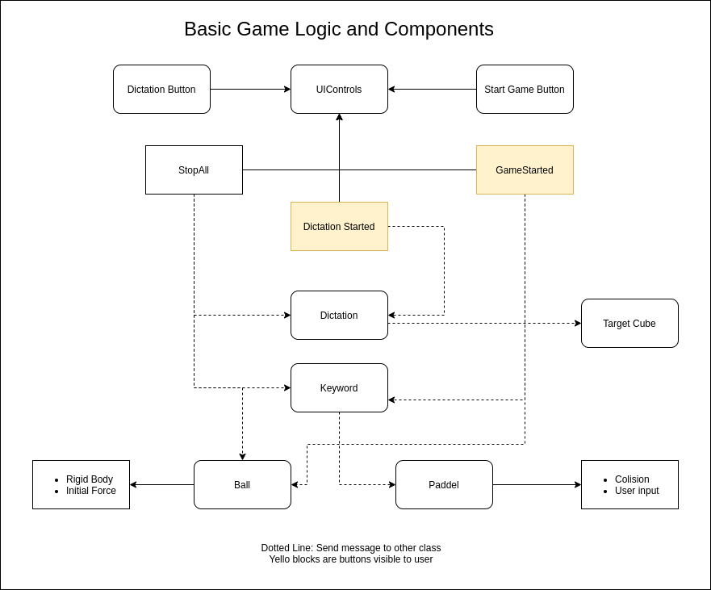
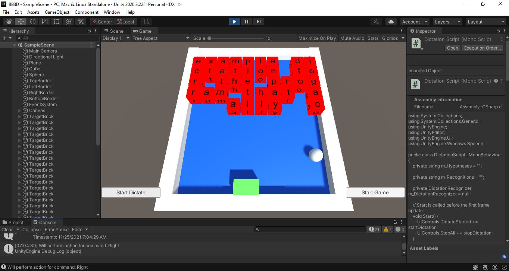

# II-P5

Objetivo El objetivo de esta práctica es aprender a utilizar las herramientas de reconocimiento de voz que Unity3D ofrece para Windows 10. Para la utilización de estas herramientas se debe importar el paquete UnityEngine.Windows.Speech. Hay que tener en cuenta que este paquete sólo está disponible para el sistema operativo Windows 10. El enunciado copleto de la practica se puede encontrar en el documento: PrácticaReconocimientoVoz.pdf

## Implementacion:

Para la implementacion se han creado 6 scripts que controlan el juego. La logica de comunicacion a un nivel muy simplificado es:

### Reconozimiento de Palabras:

Script: [scripts/RecognitionOfKeywordsToAction.cs](scripts/RecognitionOfKeywordsToAction.cs)

Para el reconocimiento de palabras se ha creado un dictionario que asocia las palabras que son registradas con funciones a ejecutar. Esto nos permite mas libertad cuando queremos expandir. En este ejemplo podemos controlar el paddel con commandos como "Left" y "Right" y podemos decir un numero para fijar el numero de saltos que hace el padel una vez que llega un commando de movimiento.

### Dictado de voz:

Script: [scripts/DictationScript.cs](scripts/DictationScript.cs)
 
El dictado es utilizado para crear los bloques que se destruyen en el juego. Para esto tenemos los funciones startDictation, stopDictation y createBrickField, la ultima crea los bloques con characteres del dictado hecho.

## El juego:

Para la implemetacion de los objetivos pedidos he creado un pequeno juego, las reglas son similares al Brick Breaker con la diferencia que la bola no puede salir por abajo y que, ademas de poder movel el "paddel" con las teclas, se puede mover diciendo los keywords. Los bloques del juego son creados a partir del dictado que se hace, cada bloque presenta un character por lo cual la cantidad de characteres es limitado al tamano del juego (max 80 characteres).

El resto es muy similar, la bola se mueve a una velocidad, y si hay collision con un bloque, este sera eliminado.

### el paddel:

Script: [scripts/PaddleControler.cs](scripts/PaddleControler.cs)

El paddel del juego tiene como casi todos los objetos un collision mesh para decir a la bola que tiene que dar la vuelta, para poder jugar se ha anadido un controlador de character para que se puede mover izquierda y derecha, esto funciona con los commando de voz y con las teclas left o right.

### la bola:

Script: [scripts/BallBehavior.cs](scripts/BallBehavior.cs)

La bola del juego es la mas importante, ya que ella se muevo y rompe los bricks. debido a esto tiene acociado fisica, pero sin friccion para que se mueve a la misma velocidad sin perder fuerza. y debido a que la tabla del juego tiene un inclinacion de 1 grado siempre va a volver al paddel.

### los bricks:

Script: [scripts/TargetCube.cs](scripts/TargetCube.cs)

Los bricks tienen su propio script, ellos son los que tienen que ser creados con los characteres imprimido por cada lado, para conseguir esto se ha creado un script que crea los 6 lados del cubo por seperado (planos), a cada uno de estos planos es acociado un canvas y un RawImage que despues contiene el Texto. una vez creado cada lado se une para formar visualmente un cubo y se añada un boxCollider para poder controlar la collision con la bola.

### UIControls:

Script: [scripts/UIControls.cs](scripts/UIControls.cs)

Para poder manejar los inputs de usuarios tenemos la clase UIControls que gestiona la UI y tiene meotdos delegate para que los otros clases pueden suscribirse a eventos.

## Complicaciones encontrados y conclusiones

Una de las principales complicaciones estaba con cambiar entre el dictado y el keyword recognizer ya que son dos sistemas diferentes que no se pueden ejecutar al mismo tiempo. Pero como se puede comprobar en la version final funciona y se ha resuelto.

Otro complicacion ha sido de crear los bricks debido a que no es tan directo como poner la textura a un char ya que espera una imagen, para resolver esto se crea unos planos grandes a las que asigna el character (a un tamano muy grande para tener un calidad aceptable) y una vez creado al cubo hacer un sclae para que queda al tamano deseado.

En concusion, ya que el keyword recognizer es lento (puede depender del hardware pero en mi portatil es muy lento) no es optimo para la implementacion en juego donde se necesita cierta rapidez. 
